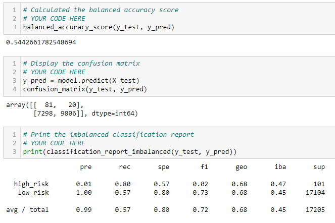

# Credit Risk Analysis 
## Overview of the Analysis (Deliverable I)
#### This exercise is meant to simulate an analysis of credit users and the liability that they may incur upon the company.  Using unsupervised machine learning, Naïve Random Oversampling, SMOTE, and Other Techniques using the libraries of scikit and imblearn.

### Naïve Random Oversampling:
  - Balance Accuracy Test: 65%
  - High Risk Precision: 1%
  - Sensitivity: 71%

### Smote Oversampling:
  - Balance Accuracy Test: 66%
  - High Risk Precision: 1%
	- Sensitivity: 63%

### Undersampling:
	- Balance Accuracy Test: 68%
	- High Risk Precision: 1%
	- Sensitivity: 80%

### Undersampling:
•	Balance Accuracy Test: 68%
•	High Risk Precision: 1%
•	Sensitivity: 80%

The focus has been on the following metrics to determine their impact.
•	How many Vine reviews and non-Vine reviews were there?
•	How many Vine reviews were 5-Stars?  How many non-Vine reviews were 5 Stars?
•	What percentage of Vine reviews were 5 Stars?  What percentage of non-Vine reviews were 5 stars? 
#### First, it important to understand the scale of the reviews.  Do to this it will be demonstrated how may unique items there are with twenty or more ratings.

#### As it can be seen there are two orders of magnitude between the Vine critics and the non-paid.
#### Lastly, it can be seen in the Step Five process how many times each community rated items in wireless five stars and what was the overall contribution to the ratings in percentage.

## Summary
#### Overall this study gives insight as to how much of a contribution paid critics are worth.  Overall the contributed less than one percent to all of the positive reviews and may not be swaying reviewers to the extent that paid reviews are justified.  The non-paid users contributed to 89 percent of the positive reviews (five stars).  Overall the less than 1 percent would probably not lend bias to the reviews.
#### It is suggest that a study would be performed to see if the Vine users and the non-paid users have reviews that roughly correlate to each other.  This would show if there is any bias in the reporting at all “Star” level.

						
