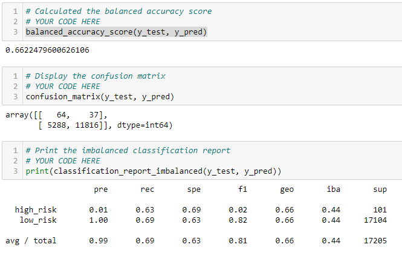

# Credit Risk Analysis 
## Overview of the Analysis (Deliverable I)
#### This exercise is meant to simulate an analysis of credit users and the liability that they may incur upon the company.  Using unsupervised machine learning, Naïve Random Oversampling, SMOTE, and Other Techniques using the libraries of scikit and imblearn.

### Naïve Random Oversampling:
  - Balance Accuracy Test: 65%
  - High Risk Precision: 1%
  - Recall:  71%
  

### Smote Oversampling:
  - Balance Accuracy Test: 66%
  - High Risk Precision: 1%
  - Recall:  63%
 

### Undersampling:
  - Balance Accuracy Test: 68%
  - High Risk Precision: 1%
  - Recall:  80%
  
  
## Overview of the Analysis (Deliverable II)
	

### Over / Under Sampling:
  - Balance Accuracy Test: 68%
  - High Risk Precision: 1%
  - Recall: 80%

## Overview of the Analysis (Deliverable III)

### Balanced Random Forest Classifier:
  - Balance Accuracy Test: 77%
  - High Risk Precision: >1%
  - Recall: 93%
  

### Easy Ensemble Classifier:
  - Balance Accuracy Test: 93%
  - High Risk Precision: >1%
  - Recall: 92%

## Summary
#### Overall, this study gives insight into each of the modeling techniques covered in the unit.  The technique is analogous to “Fake it till you make it…” where different models are continually tried unit a best fit model is observed.

#### Observing the results above, it can be seen that the best predictive model for Loan Defaults is the Easy Ensemble Classifier Model due, not only, to its high Accuracy score (@ 93%) but its high Recall (also 92% with its ability to succesfully classify data) and low High Risk Precision under 1%.  Quite simply it beats out all the other models.

						
